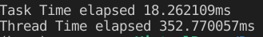

## Tasks

Async/Await is used to create tasks that can "give up" their "turn" to another task if they are waiting for something. These tasks can be scheduled by a single thread or more.
These tasks are not necessarily parallel but rather taking their turns one after another. Tasks are provided in rust by the language library and are transparent to the OS.

## Threads  

Threads mean having multiple runtimes running in parallel. Generally, that means that something is running at the same time when something else is running.
Threads are supported by the OS and underlying infrastructure. The underlying infrastructure recognizes and ensures their existence.
Unlike tasks threads have a significant coordination overhead which consumes resources.

Async/await and threads/atomics are not exclusive. In fact multiple async tasks are often scheduled in different parallel threads. So we can benefit from both technologies easily.

## Example code
The example program two functions are used to generate 100 random numbers.
These functions are timed and from their results it can be seen that the difference between the two technologies is quite significant.

The Async/Await technique generated these numbers an order of magnitude faster than the Thread/atomics technique.
This is mainly due to the context switching/maintenance overhead associated with the Thread technology. comparatively the Async technique worked in a single thread and utilized minimal maintenance overhead resulting in significant gains. 